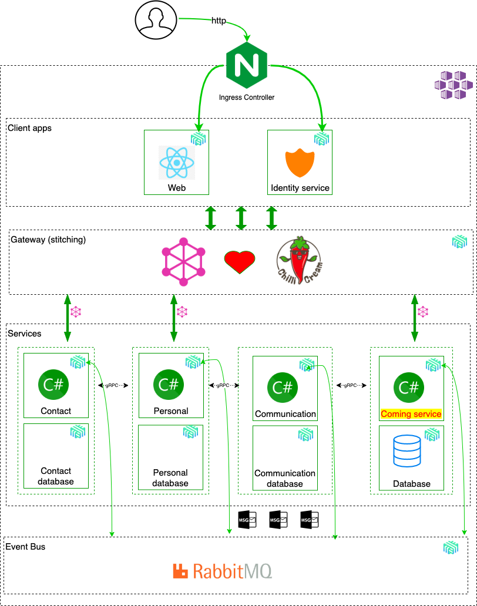
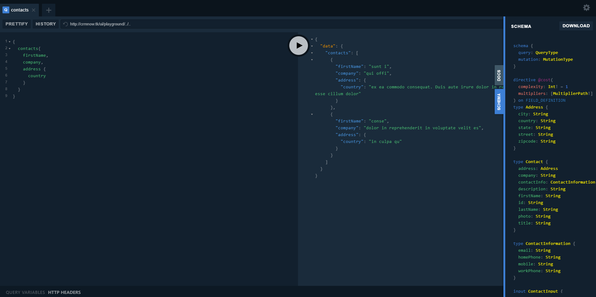
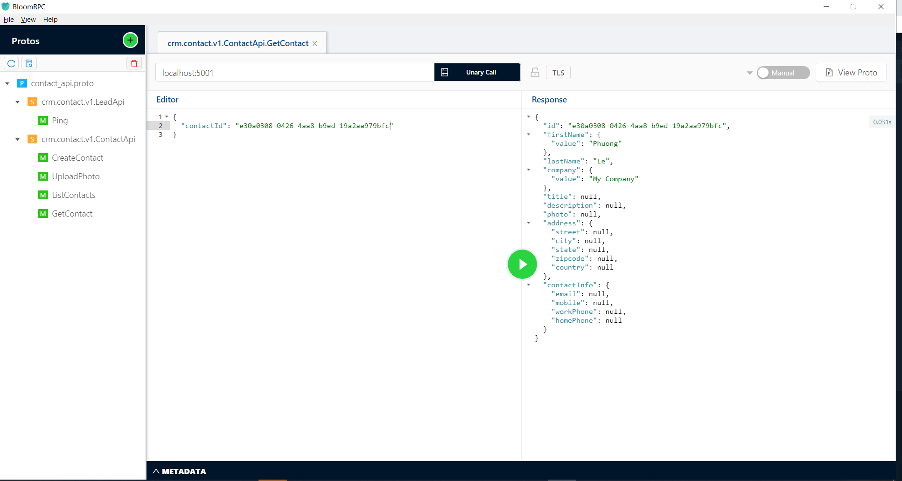
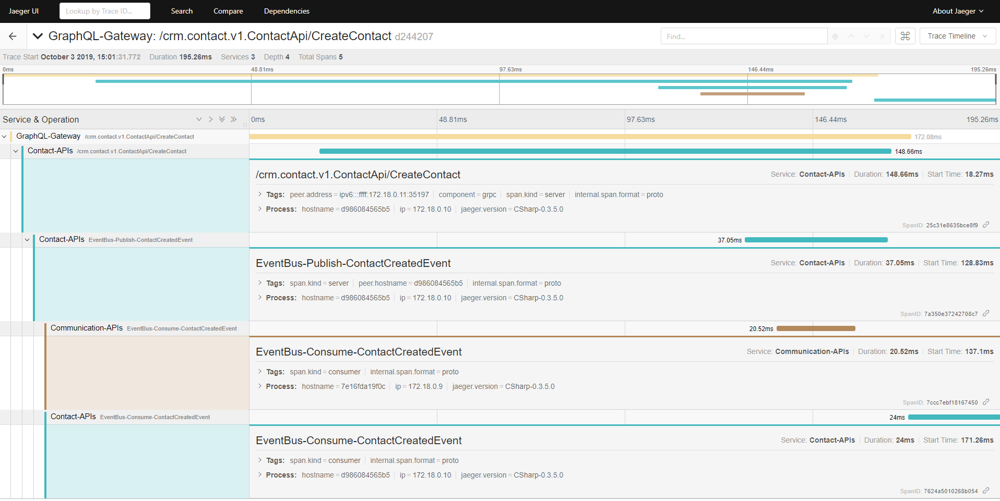

# A lightweight Customer relationship management
| Communication API   | Contact API | GraphQL gateway | 
| ------------------- | ------------------- | ------------------- | 
| [](https://dev.azure.com/jackyle/crm/_build/latest?definitionId=23&branchName=master) | [](https://dev.azure.com/jackyle/crm/_build/latest?definitionId=33&branchName=master) | [](https://dev.azure.com/jackyle/crm/_build/latest?definitionId=37&branchName=master) |

This is a simplified contact management system made in a microservice architecture, using:
* .Net Core 3.0
* GraphQL implement with [Hot Chocolate](https://github.com/ChilliCream/hotchocolate) using like a gateway
* Internal communication using [Grpc](https://github.com/grpc/grpc-dotnet)
* Using [Nats](https://nats.io/) as a message broker
* SQL database with [Postgresql](https://www.postgresql.org/)
* Storing secrets with [Vault](https://www.vaultproject.io/)
* Data migration with [Dbup](https://github.com/DbUp/DbUp/)
* Accessing database with [Dapper](https://github.com/StackExchange/Dapper)
* In-process messaging with [MediatR](https://github.com/jbogard/MediatR)
* Polly
* A modern web application with [React](https://reactjs.org/)
* Logging with [Serilog](https://github.com/serilog/serilog), [Seq](https://datalust.co/seq)
* Monitoring with [Jaeger](https://www.jaegertracing.io/), [Octant](https://github.com/vmware-tanzu/octant)
* Identity and access management with [Keycloak](https://www.keycloak.org)
* Building [Docker](https://www.docker.com/) images, managing containers and [registry](https://cloud.docker.com/u/crmnow/repository/list)
* [Docker compose](https://docs.docker.com/compose/)
* CI & CD with [Azure pipeline](https://azure.microsoft.com/en-us/services/devops/pipelines/)
* Orchestrating services using [Azure Kubernetes Service](https://azure.microsoft.com/en-us/services/kubernetes-service/)
* Deploy services to AKS by [helm 3](https://v3.helm.sh/)

# Demo
* [GraphQL gateway](http://crmnow.tk/ui/playground/)

# Architecture overview


# Getting Started
## Prerequisites
* Install **Docker**
* Install **Docker compose**
* Using **BloomRPC** to access gRPC services 

## Up and running
```bash
 docker-compose -f docker-compose.yml -f docker-compose.override.yml build

 docker-compose -f docker-compose.yml -f docker-compose.override.yml up
```
Once the containers are deployed, you can access any of the services in the following Urls or connection string:

* Web SPA: TBD
* Gateway [http://localhost:5100](http://localhost:5100/ui/playground/)
* Microservices
  * Contact service: <code>localhost:5001</code> via gRPC
  * Communication service: <code>localhost:5002</code> via gRPC
* Infrastructure
  * Postgresql, connect to <code>localhost:5432</code> with user <code>User Id=lab;Password=P@ssw0rd;</code>
    * Contact: <code>crm-contact</code>
  * Jaeger: [http://localhost:16686](http://localhost:16686/search)
  * Keycloak: [http://localhost:8080](http://localhost:8080/auth/); login with user <code>lab</code>, password <code>P@ssw0rd</code>
  * Seq: [http://localhost:5340](http://localhost:5340/#/events)
  * Vault: [http://localhost:8200](http://localhost:8200)

# Explorer the application
## GraphQL gateway
Open a browser and type [http://localhost:5100](http://localhost:5100/ui/playground/). You should see the UI like in the following screenshot:

With this **playgroud**, you can do query or mutation commands to services behind.

## Contact service with BloomRPC


## Distributed tracing


# Deploy to AKS
TBD

# Contributing
1. Fork it
2. Create your feature branch
3. Making changes and submit the pull request.

# License
Code is available under [the MIT license](https://github.com/tungphuong/crm/blob/feature/doc/LICENSE)


